# QuranMetaphor: A Multi-Task Framework for Qur'anic Metaphor Analysis

[](https://github.com/NoorBayan/Burhan)
[](https://pytorch.org/)
[](./LICENSE)
[](https://drive.google.com/file/d/1n9dCxSFWBmg1L-EPZ2MRqRyGCXWpuev7/view?usp=sharing)


> **Note:**
> This repository is designed to ensure the reproducibility of the experiments presented in the manuscript. It implements the specific hierarchical tasks (**Type, Origin, Functional Context**) and the **Qarīna-Aware Interaction Layer** described in the paper. 
> *This module is a specialized component derived from the broader "Borhan Project" for computational rhetoric.*
---

## 🏛️ Context (Background) : The Borhan Project (مشروع برهان)

This work is part of **Borhan**, a broader initiative establishing the field of **Computational Rhetoric** in Qur'anic Studies.

While the "Deep Rhetoric" framework (this paper) focuses on the **structural modeling** of metaphor using Multi-Task Learning, the larger Borhan project aims to map the full "Forest of Meaning," including tone analysis, sarcasm detection, and conceptual networks. The Qarina-Aware mechanism presented here serves as the foundational "Aesthetic Sensing" layer for these advanced applications.

### 1. The Vision: From Literal to Aesthetic
Current NLP models are "rhetorically blind." When algorithms process a verse like *"Shall we believe as the fools believed?"*, they see syntax but miss the **sarcasm**, **tone**, and **social layering**. Borhan transforms fluid literary taste into a **solid cognitive ontology**, granting digital applications an "Emotional Intelligence" parallel to their linguistic capabilities.

### 2. The Innovation: A "Holistic Forest" of Meaning
Unlike traditional approaches that treat rhetorical devices as isolated trees, Borhan maps the "Forest of Meanings" through:
*   **Granular Modeling:** Deconstructing a single image into >20 attributes (Type, Origin, Context, Tone).
*   **Pragmatic & Affective Analysis:** Detecting the *speech act* (e.g., Deprecation vs. Mitigation) behind the metaphor.
*   **Conceptual Network Mapping:** Linking images (e.g., Trade, Scales) to reveal the *Transactional Logic* of the Qur'anic worldview.
*   **Accommodating Semantic Complexity:** A hybrid architecture that rejects binary classifications in favor of **Multi-Maqasid (Multi-Intent)** recognition.

### 3. Academic Reliability
This methodology is documented in **3 in-depth research papers** currently under review at Q1 journals (SAGE, IEEE, Elsevier), ensuring that our "Qarina-Aware" algorithms meet the highest global academic standards.

---
## 📊 Dataset Description

The dataset provided in this repository (`data/dataset_experiment.csv`) is a **task-specific extraction** from the comprehensive *Borhan Rhetorical Ontology*.

While the source ontology contains granular metadata (e.g., pragmatic functions, sensory modes), this repository includes **only the three structural dimensions** modeled in the paper to establish a rigorous baseline:

*   **Total Samples:** 2,649 Verses.
*   **Target Labels:**
    1.  **Type:** Explicit (*Taṣrīḥiyya*) vs. Implicit (*Makniyya*).
    2.  **Origin:** Primary (*Aṣliyya*) vs. Derivative (*Tabʿiyya*).
    3.  **Context:** Absolute, Candidate, Implied.

*Note: The raw extended metadata is reserved for future generative tasks and is not required to reproduce the classification results reported in this study.*

## 🔬 The Specific Solution: QuranMetaphor

This repository implements the **Qarina-Aware Modeling** (Contextual Clue Awareness) described in the Borhan methodology. It tackles the challenge of **Metaphor (*Istiʿāra*)** not as a detection task, but as a hierarchical inference problem.

### Methodology
We define the problem as a set of interdependent classification tasks, translating rhetorical constraints into a **Multi-Task Learning (MTL)** architecture:

1.  **Type ($T_{type}$):** Distinguishes *Taṣrīḥiyya* (Explicit) vs. *Makniyya* (Implicit).
2.  **Origin ($T_{origin}$):** Distinguishes Primary sensory metaphors vs. Derivative associations.
3.  **Functional Context ($T_{context}$):** Analyzes whether the metaphor is extended (*Murashaha*), absolute, or abstract.

### Model Architecture
The model uses a hard parameter-sharing approach with a specialized **Qarīna-Aware Interaction Layer**—an unsupervised mechanism that mimics the human cognitive process of scanning context for "blocking indicators" (Qarīna) to resolve ambiguity.

```mermaid
graph TD
    subgraph Input_Layer["Input Layer"]
        A["Tokenized Verse (X)"]
        B["Candidate Span (s)"]
    end

    A --> C["Arabic Encoder (MARBERT / CamelBERT)"]
    B --> C

    C --> D["Hidden States"]

    subgraph Borhan_Core["Borhan Deep Rhetoric Core"]
        D --> E["Qarīna-Aware Interaction Layer"]
        E -->|Unsupervised Context Fusion| F["Refined Rhetorical Embeddings"]
    end

    subgraph Multi_Task["Multi-Task Heads"]
        F --> G["Head 1: Type"]
        F --> H["Head 2: Origin"]
        F --> I["Head 3: Context"]
    end
```




```

## ⚖️ License
This project is licensed under the MIT License - see the [LICENSE](LICENSE) file for details.
